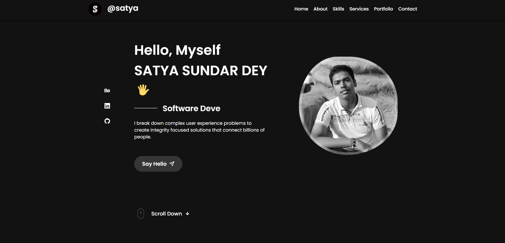

# ⚛️ React Portfolio Website - Satya Sundar Dey

Welcome to my **Formal Portfolio** built using **React.js** and **CSS Modules**.  
This portfolio showcases my skills, projects, and contact details in a responsive and elegant layout — perfect for developers, recruiters, and clients.

## 🔗 Live Preview

🌐 [Click to Visit Portfolio](https://satya-sundar-dey-portfolio.vercel.app/)

---

## 🚀 Features

- ⚛️ Built with React.js (Functional Components)
- 🎨 Scoped styling using CSS Modules
- 📱 Responsive design for all devices
- 💼 Projects section with live previews
- 🧑‍💻 About Me, Skills, and Contact section
- 🌌 Clean and formal UI design
- 🚀 Hosted via GitHub Pages

---

## 🧠 Tech Stack

- **React.js**
- **JavaScript (ES6+)**
- **CSS Modules**
- **GitHub Pages** (deployment)

---

## 📁 Folder Structure

``` 
src/
├── assets/ # Images, logos
├── components/ # Reusable components
│ ├── Header/
│ ├── About/
│ ├── Skills/
│ ├── Projects/
│ ├── Contact/
├── App.jsx # Main app component
├── App.module.css # Global app styles
└── index.js # Entry point 
```

---

## 📸 Screenshots



---

## 📬 Contact

Feel free to reach out or connect:

- 📧 Email: satyasundardey4@email.com  
- 🐙 GitHub: [dotsatya](https://github.com/dotsatya)

